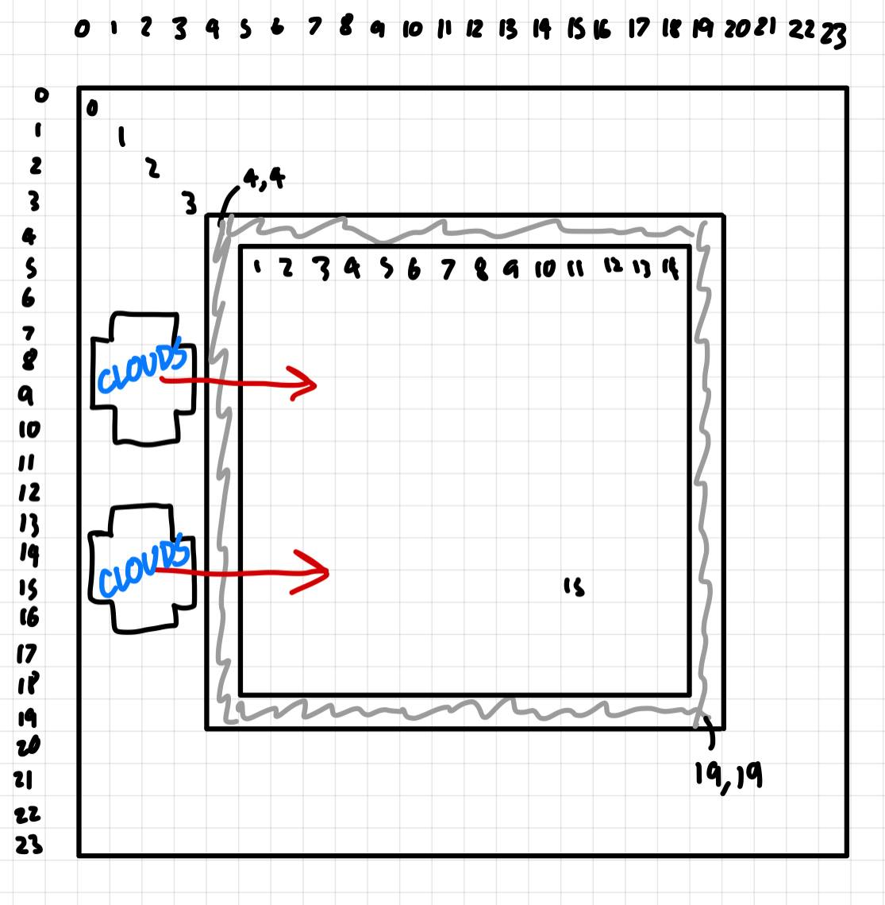

# Custom Grid Environment for a Discrete Coverage Control RL Problem

Carl Chua, Raymond Chong

## Changes

## TODO
* Add reward function / goal for the drone explorer
* Implement relevant cloud classes, and cloud spawning

## Misc
### Env diagram:

    

